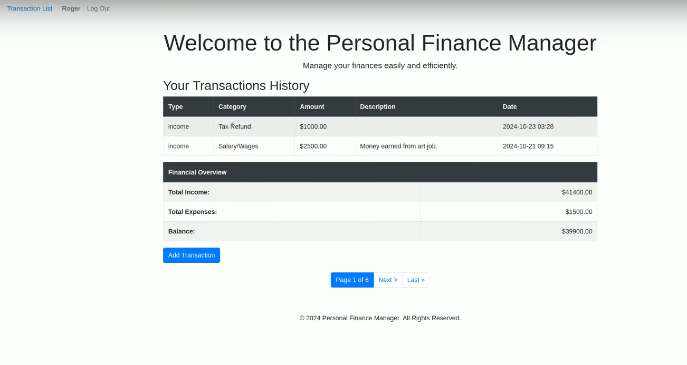

# Capstone
## Project Screenshots

### Dashboard


### Add Transaction



# Finance Manager

## 📌 Project Overview
**Finance Manager** is a comprehensive web application developed using Django to empower users in tracking and managing their finances efficiently. With its intuitive interface and robust backend, Finance Manager provides a range of features, from categorizing transactions to handling recurring expenses, enabling users to maintain a clear and organized view of their financial health.

Whether you’re managing personal expenses or aiming to monitor your spending habits over time, Finance Manager simplifies the process with dynamic tools, enhancing financial insight and accountability.
+
---

## 🔍 Distinctiveness and Complexity

### Distinctiveness
**Finance Manager** sets itself apart from traditional finance-tracking apps by blending essential tracking functionalities with advanced features. Unlike many simple financial logs, this application offers a structured approach to financial oversight by allowing user-specific categorization, integration with Django’s ORM, and advanced data handling capabilities that ensure security and data integrity. 

The clean and interactive UI is designed for a smooth user experience, while maintaining an informative dashboard view that’s suitable for users with varying degrees of financial tracking needs.

### Complexity
The project leverages a multi-layered architecture to support advanced functionality, which contributes significantly to its complexity:
- **Backend Integration with Django ORM**: Uses Django’s ORM extensively to handle complex queries and ensure user-specific financial data is stored securely.
- **User Authentication and Data Protection**: By using Django’s built-in authentication, user data is protected, giving users a secure platform to manage personal financial information.
- **Dynamic Category Loading**: Transaction categories load dynamically based on the type of transaction, a feature managed by JavaScript to enhance user experience.
- **Real-Time Balance Calculation**: The app updates balances dynamically, providing users with an instant reflection of their financial standing after each transaction.
- **Recurring Transactions**: Allows users to set up recurring expenses or incomes, automatically updating balances periodically—an advanced feature usually only available in premium applications.
- **Pagination for Transaction Listings**: For users with a large volume of transactions, pagination helps to maintain an organized interface, keeping the user experience clean and manageable.

These elements collectively give Finance Manager its unique standing, combining an intuitive front end with a highly functional backend capable of supporting complex financial tracking needs.
S
---

## 📂 File Structure

| **Directory/File**                  | **Description**                                                                 |
|-------------------------------------|---------------------------------------------------------------------------------|
| **`models.py`**                     | Contains data models for `User`, `Transaction`, `Category`, `UserBalance`, and `RecurringTransaction` which form the core structure of the application’s database. |
| **`views.py`**                      | Manages request-response cycles with view functions like `index`, `login_view`, `logout_view`, `register`, and `add_transaction`. |
| **`urls.py`**                       | Defines URL patterns, connecting URLs with respective view functions for smooth navigation. |
| **`static/FinanceManager/category.js`** | JavaScript file for dynamically loading categories based on the transaction type, optimizing data entry efficiency. |
| **`static/FinanceManager/base.js`** | General JavaScript file supporting frontend interactivity across the application. |
| **`templates/login.html`**          | Login page template for user authentication. |
| **`templates/register.html`**       | User registration page template for new account creation. |
| **`templates/add_transaction.html`** | Form template for adding transactions, allowing users to input and categorize income or expenses. |
| **`templates/index.html`**          | Main dashboard displaying an overview of the user’s financial status and recent transactions. |
| **`templates/transactions.html`**   | Template for viewing a paginated list of all transactions, ensuring clarity in data presentation. |
| **`requirements.txt`**              | Specifies necessary Python packages for the application, ensuring a seamless setup process. |

---

## 🚀 Getting Started

### Prerequisites
Ensure you have Python installed and optionally set up a virtual environment for dependency management.

installation_content = """

## 🚀 Installation Guide


### System Requirements

- **Python Version**: 3.9.1 or higher


---


### Linux


1. **Clone the Repository**:

    ```bash

    git clone <repository-url>

    cd FinanceManager

    ```


2. **Create a Virtual Environment**:

    ```bash

    python3 -m venv venv

    ```


3. **Activate the Virtual Environment**:

    ```bash

    source venv/bin/activate

    ```


4. **Install Dependencies**:

    ```bash

    pip install -r requirements.txt

    ```


   *You should see a message confirming successful installation.*


5. **Troubleshooting**:

   - If you encounter an error during `python3 -m venv venv` indicating that `ensurepip` is not available, install the required package:

     ```bash

     sudo apt install python3.9-venv

     ```


---


### Windows


1. **Clone the Repository**:

    ```cmd

    git clone <repository-url>

    cd FinanceManager

    ```


2. **Create a Virtual Environment**:

    ```cmd

    python -m venv venv

    ```


3. **Activate the Virtual Environment**:

    ```cmd

    venv\\Scripts\\activate

    ```


4. **Install Dependencies**:

    ```cmd

    pip install -r requirements.txt

    ```


   *You should see a message confirming successful installation.*


5. **Troubleshooting**:

   - If you experience installation issues, especially with packages like `Twisted`, try the following steps:

     1. Download the appropriate `.whl` file for your Python version (e.g., `Twisted-20.3.0-cp39-cp39-win_amd64.whl`).

     2. Install it manually:

        ```cmd

        pip install path\\to\\Twisted-20.3.0-cp39-cp39-win_amd64.whl

        ```

     3. Re-run:

        ```cmd

        pip install -r requirements.txt

        ```


---


### macOS


1. **Clone the Repository**:

    ```bash

    git clone <repository-url>

    cd FinanceManager

    ```


2. **Create a Virtual Environment**:

    ```bash

    python3 -m venv venv

    ```


3. **Activate the Virtual Environment**:

    ```bash

    source venv/bin/activate

    ```


4. **Install Dependencies**:

    ```bash

    pip install -r requirements.txt

    ```


   *You should see a message confirming successful installation.*


5. **Troubleshooting**:

   - If `python3 -m venv venv` fails with `ensurepip` missing, install the required package via `brew`:

     ```bash

     brew install python3

     ```


---

With these steps, Finance Manager should be successfully set up on your system.

"""


running_app_content = """

## ▶️ Running the Application


**Note**: Ensure you've completed the installation steps before proceeding.


1. **Apply Database Migrations**:

    ```bash

    python3 manage.py migrate

    ```


2. **Start the Development Server**:

    ```bash

    python3 manage.py runserver

    ```


3. **Access the Application**:

   Open your web browser and go to:

    ```

    http://127.0.0.1:8000/

    ```


---


With these steps, your Finance Manager application should be up and running locally. Enjoy managing your finances with ease!

"""


## ℹ️ Additional Information

- **Authentication & Security**: Finance Manager utilizes Django’s authentication system for secure user login and account management, ensuring data privacy and protection.
- **Categorization**: Users can categorize transactions as income or expense, allowing for quick insights into financial inflows and outflows.
- **Real-Time Balance Updates**: Transactions update the balance immediately, providing users with an up-to-date financial overview.
- **Recurring Transactions**: Automates the entry of recurring financial events, saving users time on repetitive data entry.
- **Pagination**: Keeps the UI clean and accessible, even for users with extensive financial records.
- **Deployment**: Ensure environment variables (e.g., database credentials, allowed hosts) are set up correctly for a production environment if deploying.

### Future Enhancements
To further extend Finance Manager’s capabilities, potential upgrades include:
- **Bank API Integration**: Real-time syncing with bank accounts to automate transaction entry.
- **Enhanced Analytics and Reporting**: Detailed graphical insights on spending patterns and income trends.
- **Mobile Responsiveness**: Refining the UI to offer a seamless experience across devices.

---

Finance Manager provides a full-featured solution for individuals and small businesses aiming to maintain a clear financial overview. With its robust structure, intuitive UI, and unique combination of features, this project exemplifies a thorough approach to personal finance management in Django.
